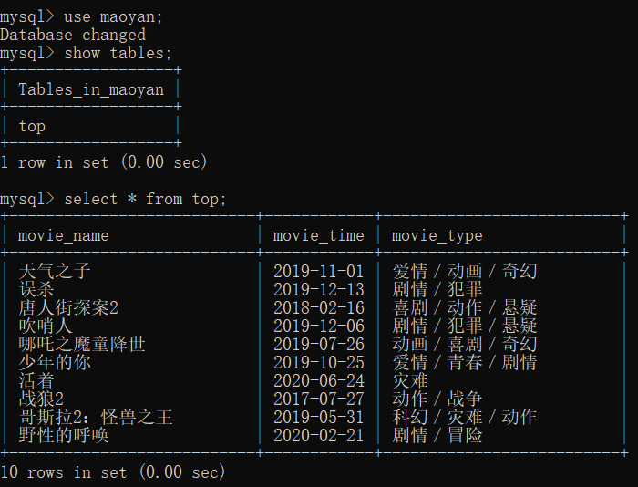

# Week02 学习笔记
### 复习 Python 基础
1. 异常的捕获和处理
2. 使用 pretty_errors 更清晰地定位问题
2. with 上下文管理器
### 学习使用 PyMySQL 操作 MySQL 数据集
1. 连接、断连 mysql
2. 执行 mysql 语句
### 学习反爬虫处理
1. 了解 http header 中的各字段含义
2. 学习使用 fake_useragent 来随机生成 user agent
3. 学习通过手动或使用 WebDriver 登录网站来获取 cookies，用于保持 Session
4. 学习Selenium WebDriver 的使用方法
5. 了解验证码识别的原理和大概流程
6. 了解使用 Redis 实现分布式爬虫的大概流程
7. 学习 Scrapy 的自带的中间件来启用系统代理IP
8. 学习自定义一个 Scrapy 的中间件来启用随机的代理IP
### 作业
1. 作业一为 scrapy_project 目录，数据库存储结果如下

2. 作业二为 selenium_project 目录
### 学习总结
1. week2感觉老师讲得没有week1手把手得详细，但是这周老师讲了很多编程学习的思维，
比如通过查看PyMySQL的源码来了解连接 mysql 时需要哪些参数。我觉得这种学习方式比
一行行代码 copy 要有用。
2. Selenum, 验证码识别和分布式 Redis 老师讲了原理和大概流程。我觉得对于入门学习很重要，
有了个整体的知识框架。之后有需求的时候，能更快深入学习。
