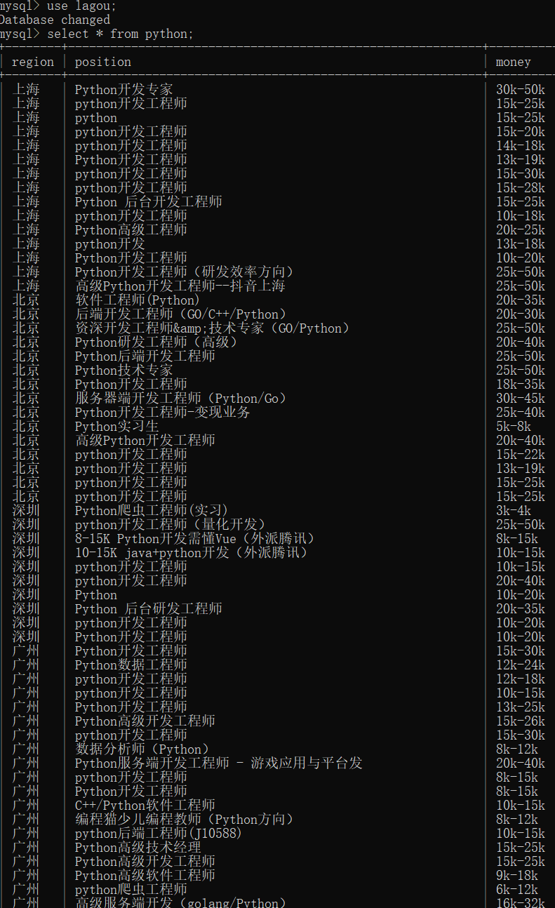

# Week03 学习笔记
#### 本周全面学习了多进程和多线程
1. 多进程和多线程区别和优缺点
2. 进程通信方式：队列、管道、共享内存
3. 进程的创建
4. 进程锁的使用
5. 进程池的使用
6. 线程的创建
7. 线程锁的使用
8. 线程池的使用
#### 作业
1. 作业一为 PortScanner目录，经测试只使用多线程比只使用多进程速度更快，可能是因为网络I/O操作较多。
2. 作业二为 LagouSpider 目录，4个城市每个城市100条，但是爬到的数量总共只有100多条，一直没找到原因，还请麻烦老师帮我看看。数据库存储效果如下.

#### 多进程和多线程的理解
1. 一个逻辑核同时只能执行一个任务。
2. 单进程就是使用一个逻辑核执行一个任务，多进程就是使用多个逻辑核执行多个任务。
3. 多线程是运行在一个进程中的，所以多线程只会使用到一个逻辑核。
4. 因为 CPython 有 GIL 全局解释锁，每个进程只有一个 GIL 锁，拿到 GIL 锁的线程才可以使用逻辑核。所以多线程其实同时只有一个线程在运行。
5. 多线程适用于在 I/O 密集型的场景，比如读写磁盘、读写网络数据包。而不适用于CPU密集型的场景，比如大量计算。
6. 多线程是跑在一个进程中的，所以多线程间同步数据更方便。
7. 多线程相比于多进程资源开销更小。
8. 执行相同任务，多进程执行速度近乎是单进程的 n 倍。（n = 进程数，1 < n ≤ CPU 逻辑核数）
9. 实际项目开发中，经常会使用多进程和多线程的一个混合方式：利用多线程去做方便通信的事，利用多进程去使用更多的逻辑核来提高执行效率。